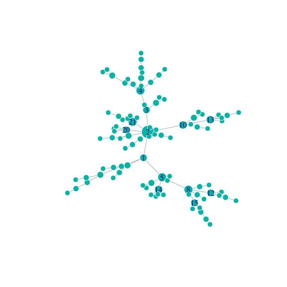
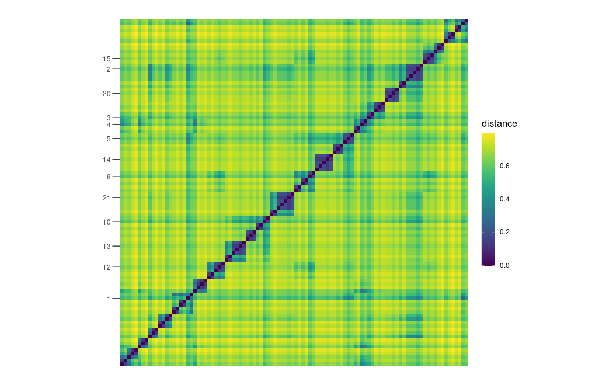

<!-- README.md is generated from README.Rmd. Please edit that file -->

# diffudist 

<!-- badges: start -->

[](https://lifecycle.r-lib.org/articles/stages.html#experimental)
[](https://github.com/gbertagnolli/diffudist/actions)
<!-- badges: end -->

## Overview

The `diffudist` package provides several functions for evaluating the
diffusion distance between nodes of a complex network.

## Installation

``` r
# Or the development version from GitHub
# install.packages("devtools")
devtools::install_github("gbertagnolli/diffudist")
```

## Usage

Additionally to `diffudist` you will also need the `igraph` package,
because the main arguments of the functions in `diffudist` are networks
as `igraph` objects.

``` r
library(diffudist)
library(igraph)
igraph_options(
  vertex.frame.color = "white",
  vertex.color = "#00B4A6",
  label.family = "sans-serif")
```

### Examples

``` r
N <- 100
g <- sample_pa(n = N, power = 1, m = 2, directed = FALSE)
deg_g <- degree(g)
vertex_labels <- 1:N
vertex_labels[which(deg_g < quantile(deg_g, .75))] <- NA
plot(g, vertex.label = vertex_labels, vertex.size = 6 + 10 * (deg_g - min(deg_g)) / max(deg_g))
```

<!-- -->

``` r
D <- get_DDM(g, tau = 2, type = "Normalized Laplacian", verbose = FALSE)
#> Unweighted network.
#> Evaluating the Normalized Laplacian matrix
MERW_Pt <- get_diffu_Pt(g, tau = 2, type = "MERW")
#> Unweighted network.
#> Evaluating the MERW Normalized Laplacian matrix
```

The probability transition matrix returned from
`get_diffusion_probability_matrix` (or its shortened version
`get_diffu_Pt`) is the matrix *e*<sup> − *τ**L*<sub>rw</sub></sup>. The
diffusion dynamics is controlled by the specific Laplacian matrix
*L*<sub>rw</sub> = *I* − *T*<sub>rw</sub>, where *T*<sub>rw</sub> is the
jump matrix of the discrete-time random walk corresponding to our
continuous-time dynamics.

Let us check that `MERW_Pt` is an actual stochastic (transition) matrix,
i.e., that its rows are probability vectors

``` r
if (sum(MERW_Pt)  - N > 1e-6) {
  print("MERW_Pt is not a stochastic matrix")
} else {
  print("MERW_Pt is a stochastic matrix")
}
#> [1] "MERW_Pt is a stochastic matrix"
```

Compute diffusion distances from the Probability matrix `MERW_Pt` as
follows:

``` r
if (requireNamespace("parallelDist", quietly = TRUE)) {
  # parallel dist
  D_MERW <- as.matrix(parallelDist::parDist(MERW_Pt))
} else {
  # dist
  D_MERW <- as.matrix(stats::dist(MERW_Pt))
}
```

And finally plot the distance matrices (requires `ggplt2`)

``` r
if (requireNamespace("tidyverse", quietly = TRUE)) {
  library(tidyverse)
  plot_ddm <- function(ddm, clustering = FALSE) {
    N <- nrow(ddm)
    as_tibble(ddm) %>%
      add_column("from" = 1:N, .before = 1) %>%
      gather(key = to, value = value, -from, factor_key = TRUE) %>%
      mutate(
        "to" = as.numeric(gsub(pattern = "V", replacement = "", x = to)),
        "value" = as.numeric(value)
      ) %>%
      ggplot(mapping = aes(x = to, y = from, fill = value)) +
        geom_tile() +
        coord_equal() +
        labs(x = "", y = "") + 
        scale_y_reverse(breaks = seq(N, 1, -10), expand = c(0, 0)) +
        scale_x_continuous(position = "top", breaks = seq(1, N, 10), expand = c(0, 0)) +
        scale_fill_distiller(palette = "Spectral", limits = c(0, ceiling(max(ddm)))) + 
        guides(fill = guide_colourbar(barwidth = 1, barheight = 10, nbin = 100)) +
        theme_minimal() +
        theme(
          panel.grid.minor = element_blank(), 
          panel.grid.major = element_blank(), 
          axis.text.x = element_blank(),
          axis.text.y = element_blank()) -> pl
      return(pl)
  }
} else {
  plot_ddm <- function(ddm, clustering = TRUE) {
    gplots::heatmap.2(D, distfun = as.dist)
  }
}
```

``` r
plot_ddm(D)
```

<!-- -->

``` r
plot_ddm(D_MERW)
```

<!-- -->

##### Plot with hierarchical clustering

``` r
gplots::heatmap.2(D, distfun = as.dist)
```

<!-- -->

``` r
gplots::heatmap.2(D_MERW, distfun = as.dist)
```

<!-- -->

## References

Bertagnolli, G., & De Domenico, M. (2021). *Diffusion geometry of
multiplex and interdependent systems*. Physical Review E, 103(4),
042301. [DOI:
10.1103/PhysRevE.103.042301](https://doi.org/10.1103/PhysRevE.103.042301),
[arXiv: 2006.13032](https://arxiv.org/abs/2006.13032),
[my-website](https://gbertagnolli.github.io/publication/ml-diffusion/).
